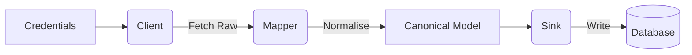

# Architecture

The SDK follows a strict three-layer pipeline:

1. **Clients**: Handle authentication, pagination, and rate limit detection.
2. **Mappers**: Convert raw API `dict` responses into canonical model instances. The raw payload is always stored in the `raw` field of every model for traceability.
3. **Canonical Models**: Plain Python `@dataclass` objects with a `to_dict()` method for serialisation.
4. **Sinks**: Write data to storage (Supabase, Postgres, BigQuery) using idempotent upsert semantics.

## Testing

- **Mappers** are tested with small JSON fixtures under `tests/fixtures/` (no network): each test loads a spec-shaped payload and asserts key fields on the canonical model.
- **Clients** use the **`responses`** library to mock `requests` (e.g. ChannelEngine pagination and HTTP 429). Default CI does not call live APIs.
- Run locally: `uv run pytest` (after `uv sync --all-extras` or `uv pip install -e ".[all,dev]"`).
